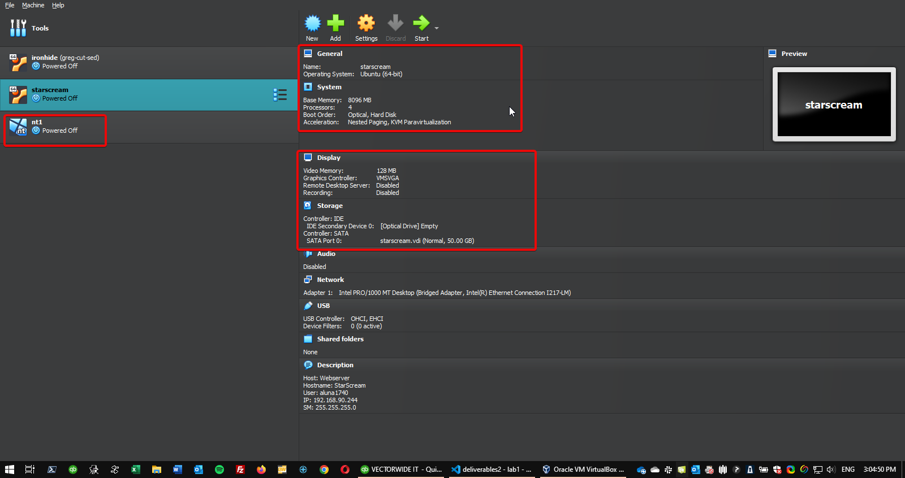
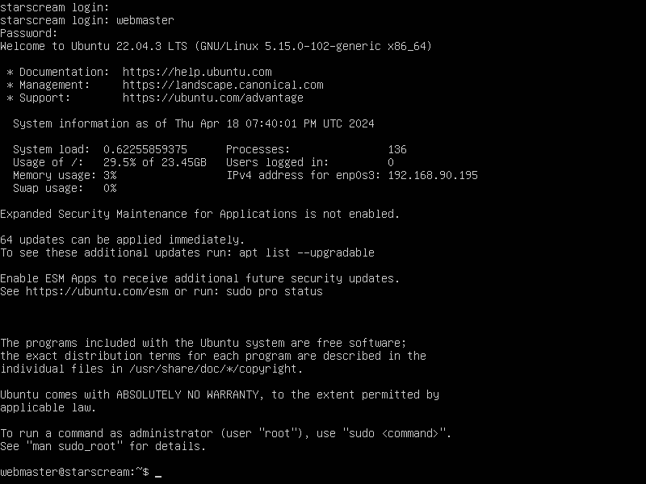
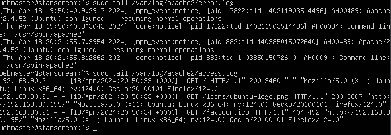
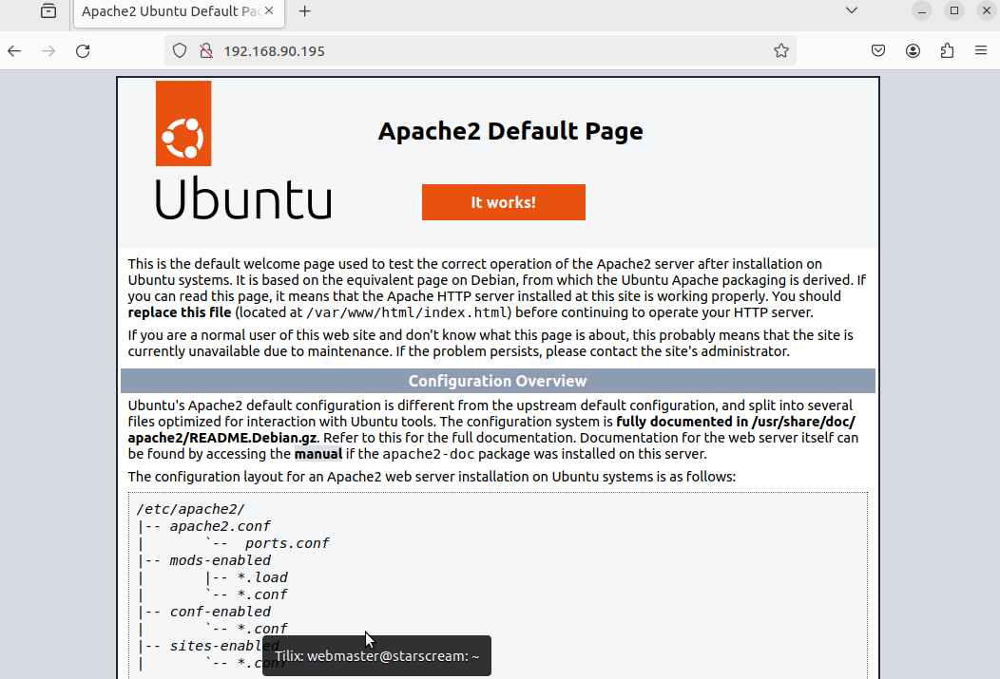
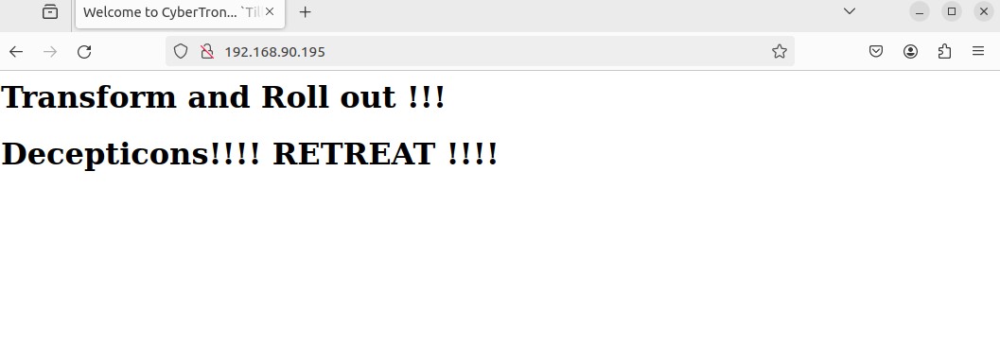

# Deliverable 2 Submission

## Server Specifications

## Ubuntu Login Screen

## Questions
3. **What is the IP address of your Ubuntu Server Virtual Machine?**
   `192.168.90.195`
4. **How do you enable the Ubuntu Firewall?**
   `sudo ufw enable`
5. **How do you check if the Ubuntu Firewall is running?**
   `sudo ufw status`
6. **How do you disable the Ubuntu Firewall?**
   `sudo ufw disable`
7. **How do you add Apache to the Firewall?** 
   `sudo ufw allow 'Apache'`
8. **What is the command you used to install Apache?**
   `sudo apt install apache2`
9.  **What is the command you use to check if Apache is running?**
    `sudo systemctl status apache2`
10. **What is the command you use to stop Apache?**
    `sudo systemctl stop apache2`
11. **What is the command you use to restart Apache?**
    `sudo systemctl restart apache2`
12. **What is the command used to test Apache configuration?**
    `sudo apache2ctl configtest`
13. **What is the command used to check the installed version of Apache?**
    `apache2 -v`
14. **What are the most common commands to troubleshoot Apache errors? Provide a brief description of each command.**
    `sudo apache2ctl configtest` checks the apache configuration for syntax errors in the configuration or service.
    `sudo tail /var/log/apache2/error.log` this command prints the last few entries of the log file. Basically, it says, show me the las few lines that were written to the error log for Apache.
    `sudo systemctl restart apache2` stops and starts the apache service. Basically it clears processes or stops and reloads the service that is responsible for running apache. It resets state without restarting the whole server.

15. **Which are Apache Log Files, and what are they used for? Provide examples and screenshots.**
    `/var/log/apache2/access.log` stores all the requests processed by the server. 
    
    `/var/log/apache2/error.log`  stores errors generated by the Apache web server.

    
    

    ### Completed
    
