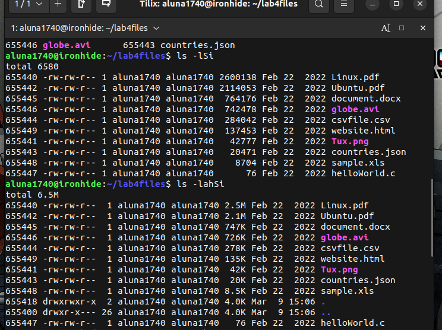

|Student: Alberto Luna|
| --- |

|Semester: Spring 24|
| --- | 

|Assignment: Lab 4|
| --- |

# Lab 4 Submission

## Question 1

## Question 2

## Question 3

## Challenge Question

## Question 3 Source Code:
[lab4-Question3](lab4_script.sh)

## Challenge Question Source code:
[lab4-Question4](changing.sh)
