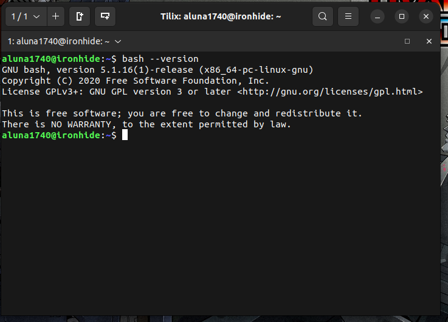

# Week Report 3
* https://github.com/aluna-pccc/cis106/blob/main/notes/notes1/notes1.md
* https://github.com/aluna-pccc/cis106/blob/main/labs/lab3/lab3.md

## Bash Shell
### Accessing the bash shell 

### Using the command history 

### My first shell script 

## Managing software
### Practice 1

### Practice 2: Install deb file via CLI

### Practice 3: Installing and removing snaps
